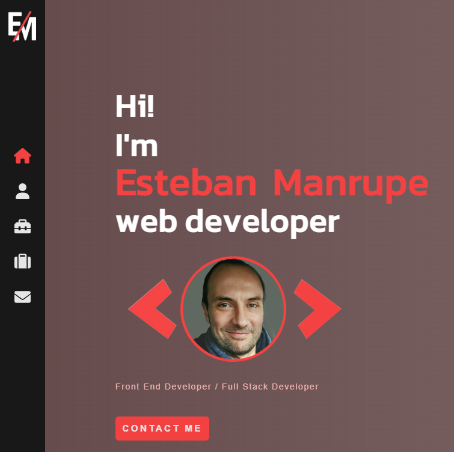

# My Portfolio

  

### Hi there!👋

My name is **`ESTEBAN MANRUPE`**, a reskilled **electronic engineer** now working as a **`Angular FrontEnd Developer`**.
 

Welcome to my **Portfolio**, built with **`React`** (**_Javascript_**), along with other libraries and tools such as:

- <a target="_blank" href="https://sweetalert2.github.io/">**Sweet Alert2**</a>
- <a target="_blank" href="https://fortawesome.com/">**Fort Awesome**</a>
- <a target="_blank" href="https://jonjaques.github.io/react-loaders/"> **React Loaders**</a>
- <a target="_blank" href="https://stephane-monnot.github.io/react-vertical-timeline/#/"> **React Vertical Timeline** <a/>

So don't forget using the command **_`npm install`_** before running this app.

After doing that, you can run the app with the command **_`npm start`_** .

### Feel free to contact me... I hope you like it!!
